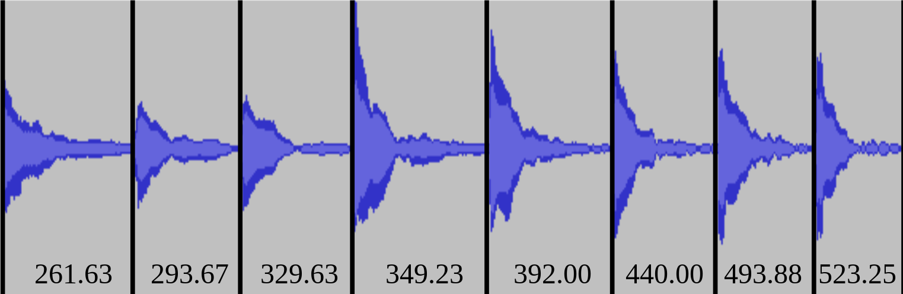

# melopak
## Audio dataset generation tool for f0 analysis.

**melopak** and **melogen** compose a toolchain to sequence an arbitrary set of frequencies and timbres to build a dataset using a MIDI synthesizer.

## Intent

Use **melogen** sequence an arbitrary set of frequencies, timbres and intensities, described in .csv files.

Record the synthesizer.

Use **melopak** to label, mix, resample, and pack raw data into instances of your dataset. 
The recording is sync automatically, and mute sections of the capture are avoided.

Frames (instances) are packed in raw format, at an user-specified sampling rate and frame lenght. One f0 label is generated for each frame and stored at a separate file.

## Example of use

Execute `source test_melopak.sh` and `source test_melogen.sh` in the ./example directory to generate and pack an example sinewave synthesizer recording into multiple instances.